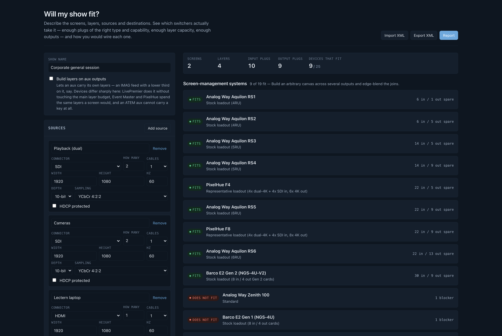

# Will my show fit? user guide

Describe a show — screens, layers, sources, destinations — and **find out which video switchers
will actually take it.**

Not "does the input count add up", but whether there is a **physical plug of the right type and
capability for every signal**, whether the layer budget covers the layers, and whether the canvas
fits the chassis. Then it proposes a wiring topology for each switcher that fits.

Nothing is uploaded. There is no backend to upload it to.

> **Before you rely on this:** every figure is transcribed from a manufacturer's published
> documentation, and **none of it has been verified against hardware.** No show has been built from
> a topology this tool proposed.
>
> Vendors revise spec sheets without notice, several of the relevant numbers are published as
> ranges or with conditions, and a few are **internally inconsistent** — one vendor's sheet
> duplicates its Aux text into the Mixers row, another disagrees with itself about output slot
> count. Both are recorded in the data rather than smoothed over. Figures that could not be sourced
> are marked `unverified` and say so in the UI.
>
> **Treat a "fits" as a shortlist, not a purchase order.**
>
> Built with AI assistance, directed and reviewed by a human author.

---

## What it checks that a count cannot

**Plugs, as a matching rather than a count.** Twelve inputs and twelve sources is not an answer:
**four SDI cameras and two SDI plugs is a "no"**, and a count will never see it. Every signal is
matched to a specific connector, respecting capability — a 4K60 source does not go into an HDMI
1.4a plug, 4:4:4 does not go down SDI, and a DisplayPort link budget is checked as well as its
pixel clock.

**The plugs that are not what they look like.** A Midra 4K output is an HDMI socket *and* a 12G-SDI
socket carrying the same picture: **that is one output, not two.** Its inputs 1 and 2 are HDMI *or*
3G-SDI — pick one. **Counting the sockets on the back panel overstates that chassis by a third.**

**Card capacity, which is not the connector count.** This is the limit that catches people out. A
Barco Event Master Gen 1 card has four connectors and takes exactly **one** 4K60 signal between
them — so a single 4K60 source consumes the whole card and strands its other three sockets.

**The backplane, separately.** The chassis caps below the sum of its cards: an E2 Gen 1 has four
output cards rated one 4K60 each and is still limited to three 4K outputs.

**The wide-screen layer penalty.** Analog Way quotes layer counts "depending on the screens setup",
and this is what that hides: a LivePremier scaling engine spans four output links, so **a layer on
a screen wider than four outputs takes a second layer link and costs twice.** It is a **cliff at
five outputs, not a slope** — going from a four-output blend to a five-output one doubles that
screen's entire layer bill, which is how a show exhausts a chassis whose headline layer count
looked ample.

**Layer capacity in each vendor's own arithmetic.** Analog Way charges a 4K mixing layer twice what
it charges a DL/2K one; Barco's ladder is 4K : DL : 2K = 1 : 2 : 4; PixelHue budgets layers **per
output card**, so an F8 advertising sixteen 4K layers still cannot put three on a screen living on
one card. **These are not modelled or derived — they are each vendor's published numbers, cited.**

**Dual- and quad-cable signals.** A 4K60 feed on two cables is two half-rate signals, which is
exactly why it fits plugs that 4K60 does not.

**Passive adapters**, where one genuinely works — HDMI↔DVI-D is the same signalling — and it says
so in the patch list rather than pretending the plug matched.

---

## Layers on aux

A global toggle, and it changes the shape of the answer rather than the ranking:

| | |
|---|---|
| **Analog Way LivePremier** | **Free.** Documented outright: layers on aux use adjacent unused outputs, not the main layer budget. |
| **Barco Event Master, PixelHue** | Charged at the same rate as an on-screen layer. |
| **Blackmagic ATEM** | **Impossible.** An aux is a clean routed bus; keys live on an M/E. |

That last row is the point of the toggle: **it turns a "which is cheapest" list into a "which can
do this at all" list.**

---

## Two kinds of machine, kept separate

A **presentation switcher** builds an arbitrary canvas across several outputs and edge-blends the
joins. A **vision mixer** does not: every output is one raster, and layers are keyers over a program
bus.

So a 7680×2160 blend is not "too big" for an ATEM the way it is too big for a Midra — **it is the
wrong shape, and the tool says so in those words.**

Vision mixers are in the database because a great many shows people reach a presentation switcher
for are one screen, one raster and two keys.

### Two things the older lines make visible

A **pre-4K Midra has no edge blending at all** — soft edge arrived with Midra 4K — so a screen there
has to fit on one output. That is a different answer from "you have run out of plugs", and is
reported as one.

**The whole Midra platform is a 165 MHz single-link machine**: 1080p60 and 1920×1200 fit;
2560×1600 and anything 4K do not, in any mode. LiveCore stops at 4K30 — to check a 4K60 display
against one, describe it as a destination fed by four cables and the tool sizes the quadrants.

---

## Custom card loadouts

When a modular chassis does not fit as it ships, **"does not fit" is only half an answer.** The
question anyone specifying a build actually has is whether a *different* set of cards would take it.

So the tool searches for one and shows the **smallest arrangement that does**, with the wiring
topology that follows.

Loadouts are enumerated in increasing card count, so the first feasible one is minimal by
construction. Among equals, **fewer distinct card types wins** — four identical cards are easier to
order and swap on site than four different ones — then the tightest fit. **The chosen loadout goes
through exactly the same evaluation as a stock profile**; there is no second, looser notion of
"fits".

---

## Trimming the report

The full report is every selected switcher with a wiring topology under each one that fits. That is
right when you are choosing a machine and **far too much when you are sending three pages to a
client who has already chosen.**

The report page carries the switcher picker plus five sections you can drop: input list, output
list, screen breakdown, wiring topology and source-document links. The example show goes from about
30,000 characters to about 5,600.

**Three things stay whatever you choose:**

- A trimmed report **prints a line saying so** — because a matrix of nine machines otherwise reads
  as the whole field to whoever receives it.
- **The caveat stays**, because a report that says what fits has to say what that rests on.
- **The signature stays** — the tool, the build version, and the line saying it is not a product of
  any manufacturer it names.

---

## If an answer surprises you

| Symptom | Cause |
| --- | --- |
| **A chassis with plenty of sockets does not fit** | Card capacity, or the backplane cap. Both are below the connector count. |
| **One extra output doubled my layer bill** | The five-output cliff. See the wide-screen penalty above. |
| **A vision mixer is rejected for a blend** | It cannot build one. That is a shape answer, not a size answer. |
| **A figure is marked `unverified`** | It could not be sourced. The build fails if anything claims to be documented without a citation. |
| **A 4K60 source will not go somewhere** | Check whether it can be described as dual- or quad-cable — half-rate signals fit plugs 4K60 does not. |
